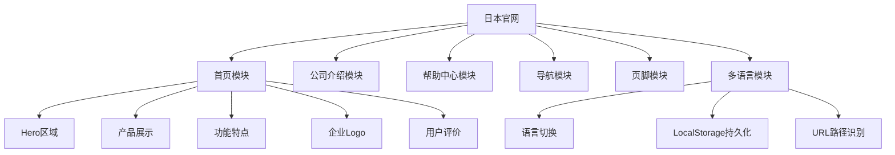
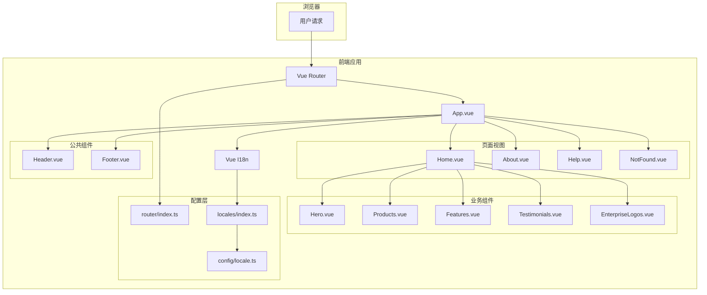
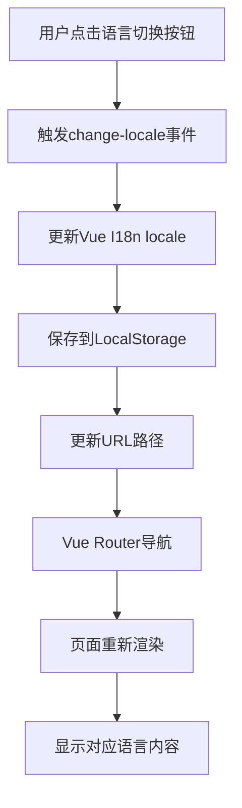

# 灵枢日本官网 - 技术方案文档

## 1. 需求分析

### 1.1 项目背景

本项目是灵枢智汇（Nexus AI）的日本语官方网站，旨在向日本用户展示三款核心AI产品（NoteGPT、VisualGPT、PhotoGPT），提供产品介绍、公司信息和帮助支持功能。

### 1.2 核心需求

| 需求编号 | 需求描述 | 需求来源 |
| :--- | :--- | :--- |
| REQ-001 | 支持三种语言：日语（默认）、简体中文、英语 | 业务需求 |
| REQ-002 | 响应式设计，适配手机、平板、桌面设备 | 用户体验 |
| REQ-003 | 首页展示产品介绍、功能特点、用户评价 | 营销需求 |
| REQ-004 | 公司介绍页面展示企业使命、愿景、价值观 | 品牌建设 |
| REQ-005 | 帮助中心页面提供常见问题解答 | 用户支持 |
| REQ-006 | 日式极简设计风格，使用和纸色配色 | 设计要求 |
| REQ-007 | 平滑滚动和动画效果提升用户体验 | 用户体验 |
| REQ-008 | 语言选择持久化到本地存储 | 用户体验 |

### 1.3 功能模块划分



---

## 2. 技术选型

### 2.1 技术栈

| 分类 | 技术 | 版本 | 选型理由 |
| :--- | :--- | :--- | :--- |
| 前端框架 | Vue.js | 3.4.21 | 渐进式框架，Composition API提供更好的代码组织 |
| 语言 | TypeScript | 5.4.5 | 类型安全，提升代码质量和开发效率 |
| 构建工具 | Vite | 5.2.8 | 快速冷启动，热模块替换，现代化构建工具 |
| 路由 | Vue Router | 4.6.4 | Vue官方路由库，支持动态路由和导航守卫 |
| 国际化 | Vue I18n | 10.0.0 | Vue官方国际化库，支持多种语言切换 |
| CSS框架 | Tailwind CSS | 3.4.14 | 实用优先的CSS框架，快速构建UI |
| 图标库 | Lucide Vue | 0.365.0 | 轻量级图标库，支持Vue组件方式使用 |

### 2.2 技术架构图



---

## 3. 架构设计

### 3.1 模块结构

| 模块 | 目录 | 职责 | 状态 |
| :--- | :--- | :--- | :--- |
| **视图层** | `src/views/` | 页面级组件，处理路由视图 | 已实现 |
| **组件层** | `src/components/` | 可复用UI组件 | 已实现 |
| **路由层** | `src/router/` | 路由配置和导航逻辑 | 已实现 |
| **国际化层** | `src/locales/` | 多语言资源文件 | 已实现 |
| **配置层** | `src/config/` | 全局配置项 | 已实现 |

### 3.2 核心组件设计

#### 3.2.1 Header组件

**文件位置**: `src/components/Header.vue`

**职责**: 提供导航菜单、语言切换、产品下拉菜单

**设计要点**:
- 响应式设计，移动端显示汉堡菜单
- 滚动时动态改变背景样式
- 产品下拉菜单展示三款产品的核心信息
- 语言切换支持日/中/英三种语言

**关键属性**:
| 属性名 | 类型 | 说明 |
| :--- | :--- | :--- |
| `currentLocale` | `string` | 当前语言代码 |

**事件**:
| 事件名 | 参数 | 说明 |
| :--- | :--- | :--- |
| `change-locale` | `lang: string` | 语言切换事件 |

#### 3.2.2 Footer组件

**文件位置**: `src/components/Footer.vue`

**职责**: 展示公司信息、产品链接、联系方式

**设计要点**:
- 深色背景，与页面主体形成对比
- 响应式网格布局
- 包含公司Logo、描述、产品链接、联系方式

#### 3.2.3 Hero组件

**文件位置**: `src/components/Hero.vue`

**职责**: 首屏展示区，包含主标题、副标题、CTA按钮

**设计要点**:
- 动态渐变背景
- 浮动动画效果
- 统计数据展示
- 双CTA按钮设计

#### 3.2.4 Products组件

**文件位置**: `src/components/Products.vue`

**职责**: 展示三款核心产品（NoteGPT、VisualGPT、PhotoGPT）

**设计要点**:
- 卡片式布局
- 悬停动效
- 产品核心功能标签
- 产品优势展示

#### 3.2.5 Features组件

**文件位置**: `src/components/Features.vue`

**职责**: 展示产品的核心功能特点

**设计要点**:
- 图标+文字组合
- 三列布局
- 数据统计展示

#### 3.2.6 Testimonials组件

**文件位置**: `src/components/Testimonials.vue`

**职责**: 展示用户评价

**设计要点**:
- 轮播展示
- 星级评分
- 用户信息展示

### 3.3 页面视图设计

#### 3.3.1 Home页面

**文件位置**: `src/views/Home.vue`

**职责**: 首页主视图，整合所有业务组件

**结构**:
```
Home.vue
├── Header
├── Hero
├── Products
├── Features
├── EnterpriseLogos
├── Testimonials
└── Footer
```

#### 3.3.2 About页面

**文件位置**: `src/views/About.vue`

**职责**: 公司介绍页面

**内容**:
- 公司使命、愿景、价值观
- 公司故事
- 团队价值观

#### 3.3.3 Help页面

**文件位置**: `src/views/Help.vue`

**职责**: 帮助中心页面

**内容**:
- 产品帮助入口
- 常见问题分类展示
- 联系方式

#### 3.3.4 NotFound页面

**文件位置**: `src/views/NotFound.vue`

**职责**: 404错误页面

**内容**:
- 错误提示信息
- 返回首页按钮

---

## 4. 路由设计

### 4.1 路由配置

| 路径 | 组件 | 名称 | 说明 |
| :--- | :--- | :--- | :--- |
| `/` | Home.vue | Home | 日语首页（默认） |
| `/:lang/` | Home.vue | HomeLocalized | 多语言首页 |
| `/:lang/about` | About.vue | About | 公司介绍页面 |
| `/:lang/help` | Help.vue | Help | 帮助中心页面 |
| `*` | NotFound.vue | NotFound | 404页面 |

### 4.2 路由命名规则

- 基础路由使用简单名称：`Home`, `About`, `Help`
- 多语言路由添加 `Localized` 后缀：`HomeLocalized`, `AboutLocalized`, `HelpLocalized`

### 4.3 导航守卫

路由配置中包含自动重定向逻辑：
- `/about` → `/ja/about`
- `/help` → `/ja/help`

### 4.4 滚动行为

```typescript
scrollBehavior(to, _from, savedPosition) {
  if (savedPosition) {
    return savedPosition
  }
  if (to.hash) {
    return {
      el: to.hash,
      behavior: 'smooth'
    }
  }
  return { top: 0 }
}
```

---

## 5. 国际化设计

### 5.1 支持语言

| 语言 | 代码 | 标签 | 默认 |
| :--- | :--- | :--- | :--- |
| 日语 | `ja` | 日本語 | 是 |
| 简体中文 | `zh` | 简体中文 | 否 |
| 英语 | `en` | English | 否 |

### 5.2 语言切换流程



### 5.3 语言数据结构

```typescript
interface Messages {
  ja: LocaleMessages
  zh: LocaleMessages
  en: LocaleMessages
}

interface LocaleMessages {
  meta: {
    title: string
    description: string
    keywords: string
  }
  header: {
    nav: {
      home: string
      products: string
      features: string
      about: string
      help: string
    }
    companyName: string
    language: Record<string, string>
  }
  hero: {
    title: string
    subtitle: string
    cta: string
    // ...其他字段
  }
  // ...其他模块
}
```

### 5.4 语言解析逻辑

**文件位置**: `src/config/locale.ts`

```typescript
// 语言优先级：URL参数 > LocalStorage > 浏览器语言 > 默认语言
export function resolveInitialLocale(): Locale {
  const saved = localStorage.getItem(LOCALE_STORAGE_KEY)
  
  if (saved !== null && SUPPORTED_LOCALES.includes(saved as Locale)) {
    return saved as Locale
  }
  
  return detectSystemLocale()
}
```

---

## 6. 样式与设计规范

### 6.1 设计主题

**日式极简风格**

| 元素 | 设计规范 |
| :--- | :--- |
| **主色调** | 和纸色 #fdfcfb |
| **强调色** | 柔和蓝 #0ea5e9 |
| **温暖色** | 珊瑚色 #f97316 |
| **文字色** | 墨色 #0f172a |
| **字体** | Noto Sans JP / Noto Sans SC / Inter |

### 6.2 自定义CSS类

| 类名 | 用途 | 实现效果 |
| :--- | :--- | :--- |
| `gradient-bg-japanese` | 背景 | 多彩渐变动画 |
| `card-hover-japanese` | 卡片 | 悬停上浮+阴影 |
| `text-gradient-japanese` | 文字 | 蓝紫橙渐变 |
| `btn-gradient-japanese` | 按钮 | 蓝色渐变 |
| `btn-warm` | 按钮 | 珊瑚色渐变 |
| `animate-float-japanese` | 动画 | 浮动效果 |
| `animate-slide-up` | 动画 | 向上滑入 |
| `backdrop-blur-japanese` | 背景 | 毛玻璃效果 |

### 6.3 Tailwind扩展配置

**文件位置**: `tailwind.config.js`

扩展颜色主题：
- `washi` - 和纸色系
- `sky` - 天空蓝系
- `coral` - 珊瑚色系
- `sumi` - 墨色系
- `wisteria` - 紫藤色系
- `seigaiha` - 青绿系

---

## 7. 状态管理

### 7.1 全局状态

| 状态 | 管理方式 | 说明 |
| :--- | :--- | :--- |
| 当前语言 | Vue I18n | 通过useI18n()获取 |
| 路由状态 | Vue Router | 通过useRoute()获取 |
| 滚动位置 | 响应式ref | 在Header组件中管理 |
| 菜单状态 | 响应式ref | 在Header组件中管理 |

### 7.2 组件间通信

| 通信方式 | 使用场景 | 示例 |
| :--- | :--- | :--- |
| Props | 父传子 | Header接收currentLocale |
| Events | 子传父 | Header触发change-locale |
| provide/inject | 深层传递 | 全局配置传递 |
| Vue I18n | 全局语言 | 所有组件共享 |

---

## 8. 性能优化

### 8.1 代码分割

使用Vue Router的懒加载：

```typescript
const routes: RouteRecordRaw[] = [
  {
    path: '/',
    name: 'Home',
    component: () => import('@/views/Home.vue')
  }
]
```

### 8.2 图片优化

- 使用WebP格式图片
- 图片懒加载
- 响应式图片尺寸

### 8.3 缓存策略

- 语言数据缓存到LocalStorage
- 路由组件缓存
- 静态资源CDN缓存

### 8.4 加载优化

- 首屏关键CSS内联
- 字体异步加载
- 组件按需渲染

---

## 9. 安全考虑

### 9.1 XSS防护

- Vue模板自动转义
- 避免使用v-html
- 对用户输入进行验证

### 9.2 路由安全

- 404页面兜底
- 无效语言参数处理
- 路径参数验证

### 9.3 隐私保护

- LocalStorage仅存储语言偏好
- 不存储敏感信息
- Cookie使用限制

---

## 10. 部署方案

### 10.1 构建配置

**开发环境**:
```bash
npm run dev    # 启动开发服务器
```

**生产环境**:
```bash
npm run build  # 构建生产版本
npm run preview # 预览构建结果
```

### 10.2 CI/CD配置

使用Cloudflare Pages自动部署：

| 配置项 | 值 |
| :--- | :--- |
| 分支 | main |
| 构建命令 | npm run build |
| 输出目录 | dist |
| 环境变量 | NODE_ENV=production |

### 10.3 环境变量

```env
VITE_APP_TITLE=霊枢智汇
VITE_APP_API_URL=https://api.nexus-ai.jp
```

---

## 11. 代码规范

### 11.1 文件命名

- 组件文件：PascalCase（如 `Header.vue`）
- 工具函数：camelCase（如 `locale.ts`）
- 目录名：kebab-case（如 `src/components/`）

### 11.2 代码风格

1. **TypeScript**: 使用严格模式，定义完整类型
2. **Vue 3**: 仅使用Composition API
3. **Tailwind**: 实用优先，避免自定义CSS
4. **导入顺序**: 外部依赖 → 内部模块 → 样式

### 11.3 注释规范

- 组件功能说明
- 复杂逻辑注释
- 接口/类型定义注释

---

## 12. 测试与质量保障

### 12.1 测试策略

| 测试类型 | 工具 | 覆盖范围 |
| :--- | :--- | :--- |
| 单元测试 | Vitest | 工具函数、组件逻辑 |
| 端到端测试 | Cypress | 页面交互、路由导航 |
| 视觉回归测试 | Percy | UI一致性 |

### 12.2 代码检查

- ESLint：代码质量检查
- Prettier：代码格式化
- TypeScript：类型检查

---

## 附录：文件清单

```
src/
├── main.ts           # 应用入口
├── App.vue           # 根组件
├── style.css         # 全局样式
├── components/       # 组件目录
│   ├── Header.vue
│   ├── Footer.vue
│   ├── Hero.vue
│   ├── Products.vue
│   ├── Features.vue
│   ├── Testimonials.vue
│   └── EnterpriseLogos.vue
├── views/            # 页面目录
│   ├── Home.vue
│   ├── About.vue
│   ├── Help.vue
│   └── NotFound.vue
├── router/           # 路由配置
│   └── index.ts
├── locales/          # 语言资源
│   └── index.ts
└── config/           # 配置文件
    └── locale.ts
```

---

**版本**: v1.0  
**创建日期**: 2026年6月  
**作者**: Raymond